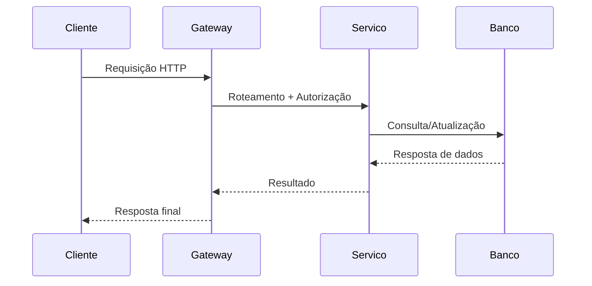

# Arquitetura de Referência de APIs

A **Arquitetura de Referência de APIs** define um conjunto de padrões, diretrizes e componentes recomendados para o desenvolvimento, integração e gestão de interfaces de programação de aplicações (APIs) de forma consistente, escalável e segura.  
O objetivo é fornecer um **modelo padronizado** que facilite a interoperabilidade entre sistemas, acelere o desenvolvimento e reduza a complexidade.

---

## 1. Objetivos

- **Padronização**: garantir que todas as APIs sigam convenções de design e segurança comuns.  
- **Reuso**: possibilitar a reutilização de componentes, bibliotecas e práticas já consolidadas.  
- **Escalabilidade**: permitir que o ecossistema de APIs cresça de forma controlada.  
- **Governança**: assegurar conformidade com políticas corporativas e regulamentações.  
- **Facilidade de manutenção**: simplificar a evolução e o suporte ao longo do ciclo de vida.

---

## 2. Componentes Principais

### 2.1. Gateway de API
- Atua como ponto único de entrada para clientes.
- Gerencia autenticação, autorização, limitação de taxa (*rate limiting*) e roteamento.
- Pode implementar cache para otimizar desempenho.

### 2.2. Serviços Backend
- Implementam a lógica de negócio.
- Podem seguir princípios de **arquitetura em microserviços** ou monólitos modulares.
- Comunicação interna pode usar HTTP/REST, gRPC, mensageria (RabbitMQ, Kafka).

### 2.3. Catálogo de APIs
- Centraliza a documentação e facilita a descoberta de serviços.
- Exemplos: **Swagger/OpenAPI**, **GraphQL Playground**.

### 2.4. Observabilidade
- **Monitoramento**: métricas de performance (latência, throughput).  
- **Logs centralizados** para rastreamento de requisições.  
- **Tracing distribuído** para entender fluxos entre serviços.

### 2.5. Segurança
- Autenticação via **OAuth 2.0** ou **OpenID Connect**.
- Autorização baseada em papéis (*RBAC*) ou atributos (*ABAC*).
- Proteção contra ataques comuns: *SQL Injection*, *XSS*, *CSRF*, *DDoS*.

---

## 3. Padrões de Design

- **REST**: uso de métodos HTTP, URIs consistentes, recursos e representações.
- **GraphQL**: consultas flexíveis e orientadas à necessidade do cliente.
- **gRPC**: comunicação binária eficiente e fortemente tipada.
- **Event-Driven APIs**: integração assíncrona baseada em eventos.

---

## 4. Boas Práticas

- **Versionamento de APIs** (ex.: `/v1/recursos`).
- **Documentação clara e atualizada** (Swagger, Redoc).
- **Testes automatizados** (unitários, integração, contrato).
- **Políticas de depreciação** para migração suave de versões.
- **Escalabilidade horizontal** e alta disponibilidade.

---

## 5. Fluxo de Requisições (Exemplo)

---

## 6. Benefícios

- Redução do tempo de desenvolvimento.
- Maior consistência na experiência do consumidor da API.
- Segurança reforçada por padrões e ferramentas comuns.
- Melhor manutenção e evolução de longo prazo.

---

## 7. Conclusão

A **Arquitetura de Referência de APIs** não é um modelo fixo, mas sim um **guia adaptável** às necessidades da organização.  
Adotá-la significa investir em qualidade, escalabilidade e governança, criando uma base sólida para o ecossistema de serviços digitais.
